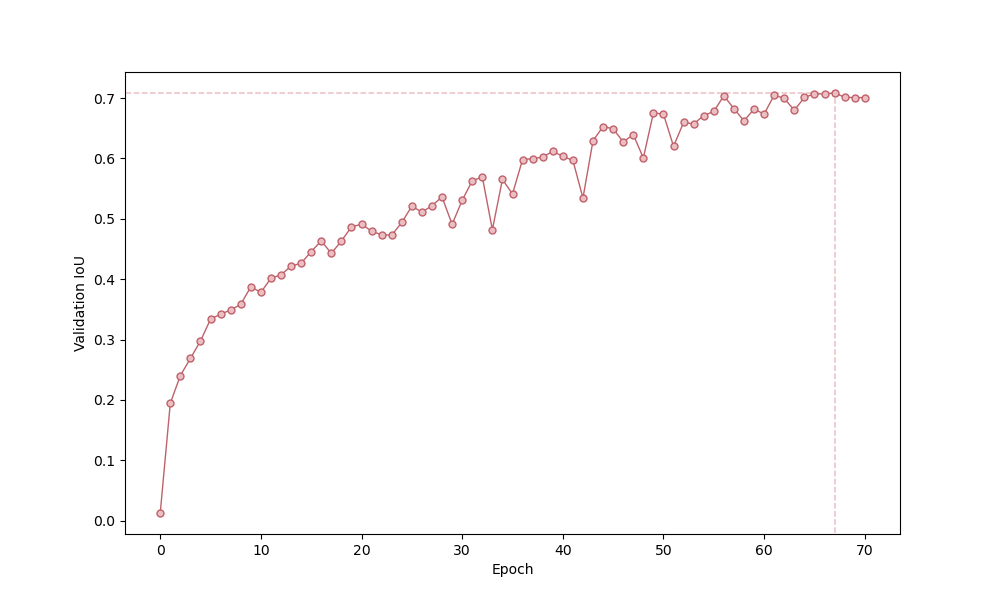

# ERFNet - TensorFlow 2

This is an unofficial implementation of [ERFNet](http://www.robesafe.es/personal/eduardo.romera/pdfs/Romera17tits.pdf) for semantic segmentation on the [Cityscapes dataset](https://www.cityscapes-dataset.com/).

## Results


The above predictions are produced by a network trained for 67 epochs, which achieves a mean class IoU score of 0.7084 on the validation set. The full training lasted 70 epochs (almost 10 hours on a single Tesla P100 GPU), but I used the checkpoint with maximum validation score for inference. The progression of this metric is shown below ([here](assets/iou_plot.pdf) with better quality):



Furthermore, the inference time on a Tesla P100 GPU is around 0.2 seconds per image.

## Software installation

Clone this repository:

```bash
git clone https://github.com/garder14/erfnet-tensorflow2.git
cd erfnet-tensorflow2/
```

Install the dependencies:

```bash
conda create -n tf-gpu tensorflow-gpu cudatoolkit=10.1
conda activate tf-gpu
pip install tensorflow_addons==0.10.0 Pillow==7.1.2
```

## Training

Before training the network, you need to download the Cityscapes dataset. For this purpose, create an account in [www.cityscapes-dataset.com](https://www.cityscapes-dataset.com/), and then run the following command (indicating your username and password):

```bash
bash download_data.sh username password
```

To train the network, run the following command:

```bash
python train.py --num_epochs 70 --batch_size 8 --evaluate_every 1 --save_weights_every 1
```

By default, training resumes from the latest saved checkpoint. If the checkpoints/ directory is missing, training starts from epoch 0.

## Inference

Run the following command to predict the semantic segmentation of every image in the test_images/ directory (note: results are generated in the test_segmentations/ directory). It is required to specify the location of the weights (you can use the pretrained weights pretrained/pretrained.h5, or any other weights saved during your own training in the saved_weights/ directory).

```bash
python predict.py --weights pretrained/pretrained.h5
```

## References

* [E. Romera et al., "ERFNet: Efficient Residual Factorized ConvNet for Real-time Semantic Segmentation", 2017](http://www.robesafe.es/personal/eduardo.romera/pdfs/Romera17tits.pdf)

* [Official PyTorch implementation of ERFNet](https://github.com/Eromera/erfnet_pytorch)
