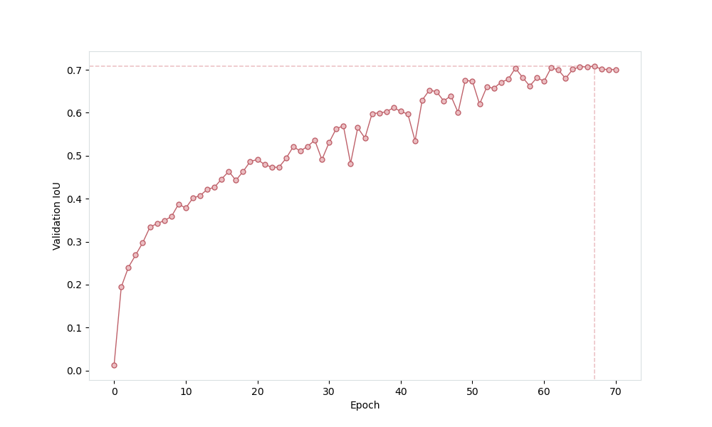

# ERFNet - TensorFlow 2

This is an unofficial implementation of [ERFNet](http://www.robesafe.es/personal/eduardo.romera/pdfs/Romera17tits.pdf) for semantic segmentation on [Cityscapes dataset](https://www.cityscapes-dataset.com/).

## Results


To achieve these results, I have trained the network for 70 epochs on a single Tesla P100 GPU (~10 hours), and have used the weights with the largest IoU score on validation set (0.7084 after epoch 67). The evolution of validation score over epochs is shown below ([here](assets/iou_plot.pdf) with better quality):



The inference time on Tesla P100 GPU is ~0.2 seconds/image.

## Software installation

Clone this repository:

```bash
git clone https://github.com/garder14/erfnet-tensorflow2.git
cd erfnet-tensorflow2/
```

Install the dependencies:

```bash
conda create -n tf-gpu tensorflow-gpu cudatoolkit=10.1
conda activate tf-gpu
pip install matplotlib=3.2.2 tensorflow_addons=0.10.0 Pillow=7.1.2
```

## Training

First, it is required to download the Cityscapes dataset. For this purpose, create an account [here](https://www.cityscapes-dataset.com/), and then run the following command with your username and password:

```bash
bash download_data.sh username password
```

Now, to train the network, run the following command (more options are available):

```bash
python train.py --num_epochs 70 --batch_size 8 --evaluate_every 1 --save_weights_every 1
```

A checkpoint is saved after each epoch, so you can always continue the training from where you left it. Note: once you run the training command, the latest checkpoint is restored, so you should remove the checkpoints/ directory if you want to restart training.

The weights are saved in the saved_weights/ directory.

## Inference

Run the following command to predict the semantic segmentation of every image in the test_images/ directory. Note that these are saved in the test_segmentations/ directory, and one has to specify the relative path to the model weights (you can use the pretrained weights pretrained/pretrained.h5).

```bash
python predict.py --weights pretrained/pretrained.h5
```

## References

* [E. Romera et al., "ERFNet: Efficient Residual Factorized ConvNet for Real-time Semantic Segmentation", 2017](http://www.robesafe.es/personal/eduardo.romera/pdfs/Romera17tits.pdf)

* [ERFNet (Official PyTorch version)](https://github.com/Eromera/erfnet_pytorch)
